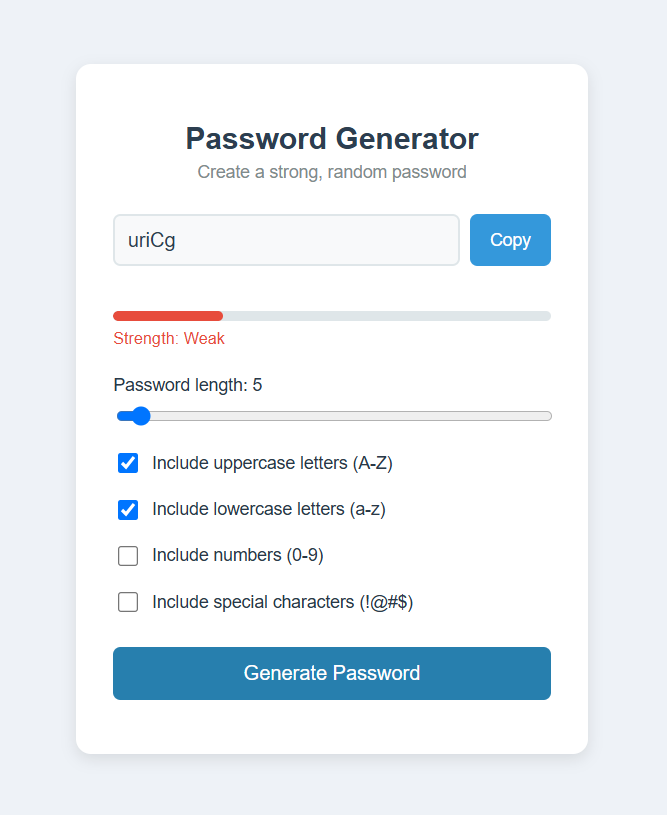
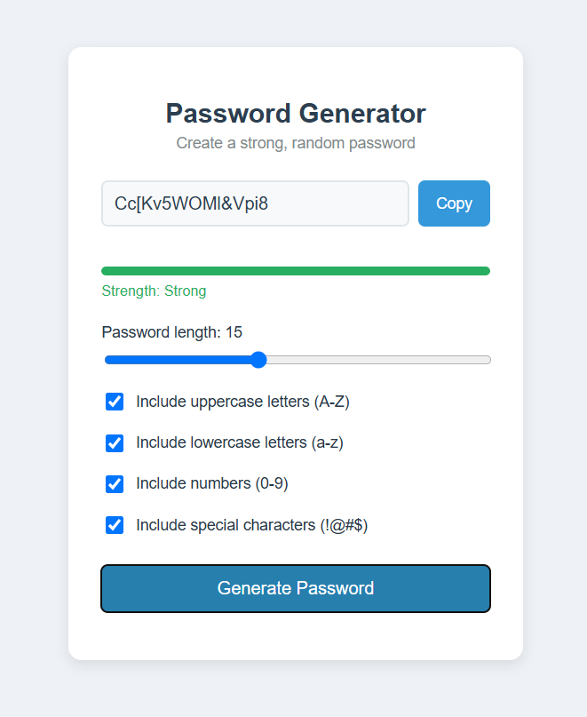

# Password Generator

A simple, beginner-friendly password generator built with plain HTML, CSS, and JavaScript — no frameworks or libraries required.

## Features

- Generate random passwords with a custom length (4–32 characters)
- Choose which character types to include:
  - Uppercase letters (A–Z)
  - Numbers (0–9)
  - Special characters (!@#$%^&*)
- Copy the generated password to your clipboard with one click
- Live password strength meter (Weak / Medium / Strong)

## 📸 Screenshots





## File Structure

```
beginner-version/
├── screenshot1.png
├── screenshot2.png
├── index.html
├── pass.py
├── style.css
├── script.js
└── README.md

```

## How to Run

1. Download or clone this folder.
2. Open `index.html` in your browser (double-click it, or right-click → Open With → your browser).
3. Adjust the length slider and checkboxes, then click **Generate Password**.

## How It Works

- **HTML** (`index.html`) sets up the page: the input box, slider, checkboxes, and buttons.
- **CSS** (`style.css`) styles everything: the card layout, colors, and the strength bar.
- **JavaScript** (`script.js`) does the logic:
  1. Builds a pool of characters based on which checkboxes are checked.
  2. Uses `Math.random()` to pick random characters from that pool.
  3. Scores the resulting password based on its length and character variety.
  4. Updates the strength bar color and label to match the score.
  5. Copies the password to the clipboard using the Clipboard API.

## Notes

- This project uses `Math.random()`, which is fine for learning and casual use, but is **not cryptographically secure**. For passwords protecting real accounts, use a dedicated password manager or a generator built on `crypto.getRandomValues()`.
- No external libraries, frameworks, or build tools are used — just plain HTML/CSS/JS, making it a good project for learning the fundamentals.

## Possible Improvements

- Add a "show/hide password" toggle
- Save recently generated passwords in a list
- Add dark mode
- Warn the user if no character types are selected

## License

Free to use and modify for learning purposes.